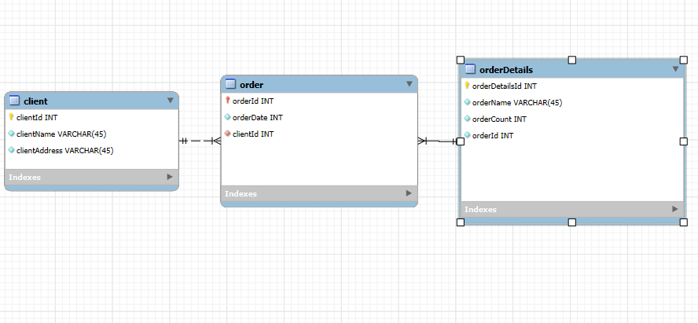
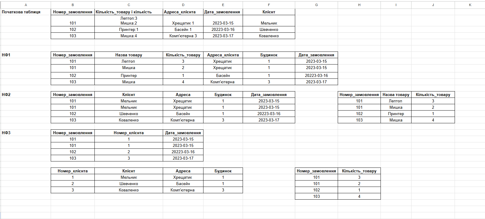
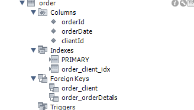

# 📚 Домашнє завдання: Нормалізація бази даних та ER-діаграма

## ✅ Завдання

1. **Переведіть початкову таблицю в першу нормальну форму (1NF).**
2. **Переведіть нові таблиці в другу нормальну форму (2NF).**
3. **Переведіть нові таблиці в третю нормальну форму (3NF).**
4. **Розробіть ER-діаграму отриманих таблиць.**

> 💡 Використовуйте зрозумілі та конкретні імена для сутностей та атрибутів. Уточнюйте типи даних для атрибутів. Перевірте, чи всі відношення й атрибути мають чіткі і зрозумілі кардинальності та значення.

5. **Використовуючи ER-діаграму, створіть таблиці в базі даних.**  
   Таблиці повинні містити тільки структуру (без значень), із чітко прописаними полями, типами та зовнішніми ключами.

---

## 🧾 Початкова таблиця

| Номер_замовлення | Назва_товару і кількість | Адреса_клієнта | Дата_замовлення | Клієнт     |
|------------------|---------------------------|----------------|------------------|------------|
| 101              | Лептоп: 3, Мишка: 2       | Хрещатик 1     | 2023-03-15       | Мельник    |
| 102              | Принтер: 1                | Басейна 2      | 2023-03-16       | Шевченко   |
| 103              | Мишка: 4                  | Комп’ютерна 3  | 2023-03-17       | Коваленко  |

---

